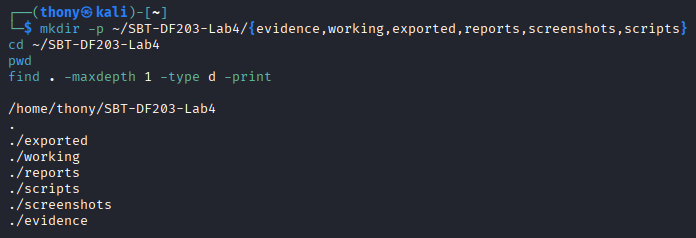
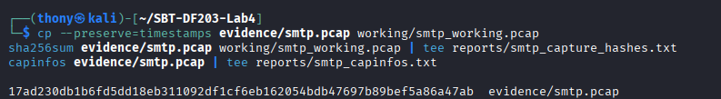
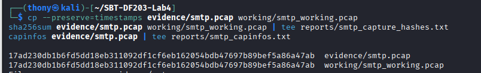
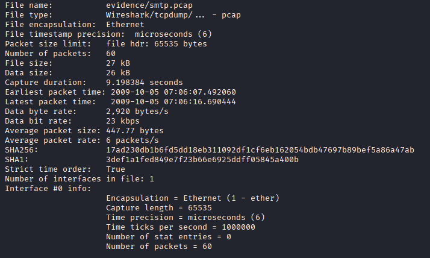
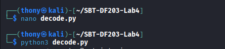
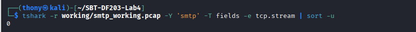
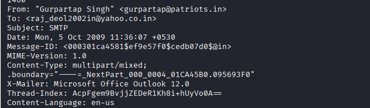
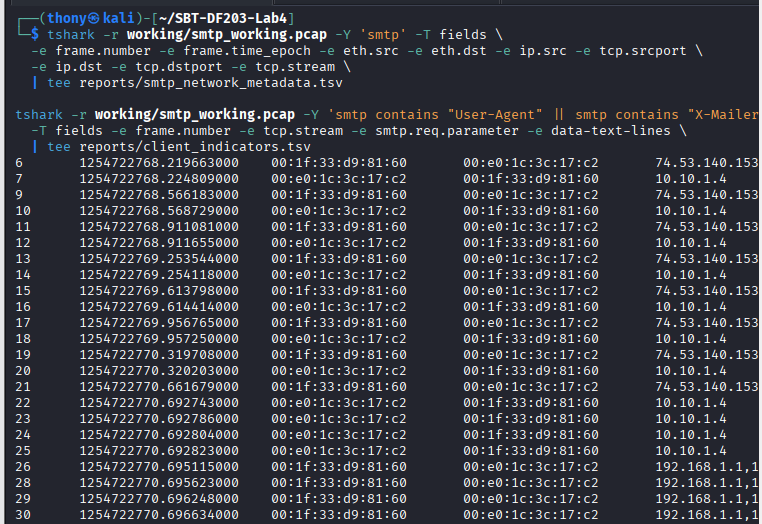
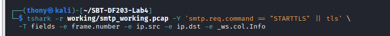

# SBT-DF203 Lab 4 — SMTP Email Traffic Forensics


**Trainee:** Akinwa Omokunle Anthony
**Registration No:** 2025/FWSD/11206
**Course:** SBT-DF203 — Basic Networking Skills for Digital Forensics
**Lab:** Lab 4 — SMTP Email Traffic Forensics
**Instructor:** Aminu Idris, AMCPN
**Delivery Block:** 2/3 of 3 | 12–18 September 2026
**Date:** 13/08/2026

---

## Table of Contents

1. [Executive Summary](#1-executive-summary)
2. [Objectives](#2-objectives)
3. [Tools and Environment](#3-tools-and-environment)
4. [Methodology](#4-methodology)
   - [4.1 Lab Folder Structure and Evidence Preparation](#41-lab-folder-structure-and-evidence-preparation)
   - [4.2 Chain of Custody](#42-chain-of-custody)
5. [Part A — Inventory the Capture and Locate SMTP Streams](#5-part-a--inventory-the-capture-and-locate-smtp-streams)
6. [Part B — Identify Commands and Response Codes](#6-part-b--identify-commands-and-response-codes)
7. [Part C — Decode Base64 Authentication Evidence](#7-part-c--decode-base64-authentication-evidence)
8. [Part D — Reconstruct the Email Message](#8-part-d--reconstruct-the-email-message)
9. [Part E — Determine Client, Hosts and Network Metadata](#9-part-e--determine-client-hosts-and-network-metadata)
10. [Part F — Encryption and Evidential Limitations](#10-part-f--encryption-and-evidential-limitations)
11. [Required Findings Worksheet](#11-required-findings-worksheet)
12. [Analysis and Findings](#12-analysis-and-findings)
13. [Challenges and Solutions](#13-challenges-and-solutions)
14. [Conclusion](#14-conclusion)
15. [Appendix](#15-appendix)
16. [Screenshots Checklist](#16-screenshots-checklist)

---

## 1. Executive Summary

This practical investigated SMTP email traffic using a supplied packet capture file, `smtp.pcap`. The investigation focused on identifying the SMTP client and server, analysing SMTP commands and response codes, examining authentication evidence, reconstructing the email conversation, and extracting network metadata such as IP addresses, ports, MAC addresses and timestamps.

Wireshark and TShark were used to filter and analyse the traffic, while Python 3 was used to decode Base64 values offline. The original evidence was preserved and a working copy was created and verified using SHA-256 hashing. The analysis confirmed a single plaintext SMTP session between client **10.10.1.4** (port 1470) and server **74.53.140.153** (port 25, `xc90.websitewelcome.com`, Exim 4.69), during which credentials and message content were transmitted without TLS protection.

---

## 2. Objectives

The objectives of this lab were to:

1. Explain the role of SMTP and distinguish plaintext SMTP, STARTTLS and implicit TLS.
2. Identify SMTP commands, server response codes and authentication exchanges.
3. Reassemble an SMTP TCP stream and reconstruct message headers and body.
4. Decode Base64 values in a controlled offline manner.
5. Extract timestamps, client software, IP addresses, ports and MAC addresses.
6. Assess evidential limitations when encryption is used or capture is incomplete.

---

## 3. Tools and Environment

| Item | Tool |
|------|------|
| Operating system | Kali Linux (VM) |
| Packet analysis | Wireshark, TShark, capinfos |
| Decoder | Python 3 (`base64` module) |
| Hashing | `sha256sum` |
| Shell | Linux command line |
| Editor | Nano / text editor |

---

## 4. Methodology

### 4.1 Lab Folder Structure and Evidence Preparation

**Step 1 — Create folder structure**

```bash
mkdir -p ~/SBT-DF203-Lab4/{evidence,working,exported,reports,screenshots,scripts}
cd ~/SBT-DF203-Lab4
pwd
find . -maxdepth 1 -type d -print
```


*Fig 1.1 — Lab folder structure.*

**Step 2 — Install required tools**

```bash
sudo apt update
sudo apt install -y wireshark tshark python3
```

**Step 3 — Download evidence and hash both copies**

```bash
wget -O evidence/smtp.pcap 'https://wiki.wireshark.org/uploads/__moin_import__/attachments/SampleCaptures/smtp.pcap'
cp --preserve=timestamps evidence/smtp.pcap working/smtp_working.pcap
sha256sum evidence/smtp.pcap working/smtp_working.pcap | tee reports/smtp_capture_hashes.txt
capinfos evidence/smtp.pcap | tee reports/smtp_capinfos.txt
```


*Fig 1.2 — SHA-256 hash of the working copy.*


*Fig 1.3 — SHA-256 hash of the original capture.*


*Fig 1.4 — capinfos summary of `smtp.pcap`.*

### 4.2 Chain of Custody

| Field | Student Entry |
|-------|---------------|
| Case/lab identifier | SBT-DF203-Lab4-Akinwa Omokunle Anthony |
| Trainee name | Akinwa Omokunle Anthony |
| Date and time started | 12th September, 2026 |
| Evidence file name(s) | `smtp.pcap` |
| Source / generation method | Provided PCAP (Wireshark SampleCaptures) |
| Original SHA-256 | `17ad230db1b6fd5dd18eb311092df1cf6eb162054bdb47697b89bef5a86a47ab` |
| Working-copy SHA-256 | `17ad230db1b6fd5dd18eb311092df1cf6eb162054bdb47697b89bef5a86a47ab` |
| Analysis workstation | Kali Linux VM (user: thony) |
| Notes on changes | No changes — hashes match |

*Table 1.1 — Chain of Custody.*

---

## 5. Part A — Inventory the Capture and Locate SMTP Streams

```bash
tshark -r working/smtp_working.pcap -q -z conv,tcp | tee reports/tcp_conversations.txt

tshark -r working/smtp_working.pcap -Y 'smtp' -T fields \
  -e frame.number -e frame.time -e ip.src -e tcp.srcport \
  -e ip.dst -e tcp.dstport -e _ws.col.Info \
  | tee reports/smtp_packet_inventory.tsv
```

| Item | Value |
|------|-------|
| Server SMTP port | 25 |
| Client ephemeral port | 1470 |
| First packet time | 2009-10-05T07:06:08.219663000+0100 (frame 6) |
| Last packet time | 2009-10-05T07:06:15.105467000+0100 (frame 56) |
| Number of SMTP frames | 33 (29 excluding ICMP replies) |

*Table 1.2 — SMTP stream inventory.*

> **Note:** Frames 26, 28, 29 and 30 are ICMP "Destination unreachable (Fragmentation needed)" messages, not SMTP frames. Excluding these, the SMTP frame count is **29**.

---

## 6. Part B — Identify Commands and Response Codes

```bash
tshark -r working/smtp_working.pcap -Y 'smtp.req || smtp.rsp' -T fields \
  -e frame.number -e frame.time -e ip.src -e ip.dst \
  -e smtp.req.command -e smtp.req.parameter \
  -e smtp.response.code -e _ws.col.Info \
  | tee reports/smtp_commands_responses.tsv
```

| Seq | Direction | Command/Code | Meaning | Timestamp |
|-----|-----------|--------------|---------|-----------|
| 1 | Server → Client | 220 | Service ready | 2009-10-05T07:06:08.219663000+0100 (frame 6) |
| 2 | Client → Server | EHLO/HELO | Client greeting | 2009-10-05T07:06:08.224809000+0100 (frame 7) |
| 3 | Client → Server | AUTH | Authentication method | 2009-10-05T07:06:08.568729000+0100 (frame 10) |
| 4 | Client → Server | MAIL FROM | Envelope sender | 2009-10-05T07:06:09.614414000+0100 (frame 16) |
| 5 | Client → Server | RCPT TO | Envelope recipient | 2009-10-05T07:06:09.957250000+0100 (frame 18) |
| 6 | Client → Server | DATA | Message content begins | 2009-10-05T07:06:10.320203000+0100 (frame 20) |
| 7 | Client → Server | QUIT | Session termination | 2009-10-05T07:06:14.763825000+0100 (frame 54) |

*Table 1.3 — SMTP commands and response codes.*

---

## 7. Part C — Decode Base64 Authentication Evidence

**Script used (`scripts/decode_base64.py`):**

```python
import base64

samples = {
    'username': 'Z3VycGFydGFwQHBhdHJpb3RzLmlu',
    'password': 'cHVuamFiQDEyMw=='
}

for label, value in samples.items():
    try:
        decoded = base64.b64decode(value).decode('utf-8', errors='replace')
        print(f'{label}: {decoded}')
    except Exception as exc:
        print(f'{label}: decode failed: {exc}')
```

Run:

```bash
python3 scripts/decode_base64.py | tee reports/base64_decoded.txt
```


*Fig 1.5 — Base64 authentication evidence decoded offline.*

**Masked results:** `g********p@patriots.in` and `P********3`

> Full decoded values are retained only in the protected evidence appendix, per the lab's reporting rule.

---

## 8. Part D — Reconstruct the Email Message

**Step 1 — Find the stream number**

```bash
tshark -r working/smtp_working.pcap -Y 'smtp' -T fields -e tcp.stream | sort -u
```

Result: stream **0**.


*Fig 1.6 — Identify the SMTP TCP stream number.*

**Step 2 — Follow the stream and extract headers**

```bash
tshark -r working/smtp_working.pcap -q -z follow,tcp,ascii,0 \
  | tee reports/smtp_stream_0.txt

grep -Ei '^(Date|From|To|Subject|Message-ID|MIME-Version|Content-Type|User-Agent|X-Mailer):' \
  reports/smtp_stream_0.txt | tee reports/message_headers.txt
```


*Fig 1.7 — Reconstructed email headers.*

| Field | Value |
|-------|-------|
| From | "Gurpartap Singh" `<gurpartap@patriots.in>` |
| To | `<raj_deol2002in@yahoo.co.in>` |
| Subject | SMTP |
| Date | Mon, 5 Oct 2009 11:36:07 +0530 |
| Message-ID | `<000301ca4581$ef9e57f0$cedb07d0$@in>` |
| MIME-Version | 1.0 |
| Content-Type | multipart/mixed; boundary="----=_NextPart_000_0004_01CA45B0.095693F0" |
| X-Mailer | Microsoft Office Outlook 12.0 |
| Thread-Index | `AcpFgem9BvjjZEDeR1Kh8i+hUyVo0A==` |
| Content-Language | en-us |

*Table 1.4 — Reconstructed email headers.*

---

## 9. Part E — Determine Client, Hosts and Network Metadata

```bash
tshark -r working/smtp_working.pcap -Y 'smtp' -T fields \
  -e frame.number -e frame.time_epoch -e eth.src -e eth.dst \
  -e ip.src -e tcp.srcport -e ip.dst -e tcp.dstport -e tcp.stream \
  | tee reports/smtp_network_metadata.tsv

tshark -r working/smtp_working.pcap -Y 'smtp contains "User-Agent" || smtp contains "X-Mailer"' \
  -T fields -e frame.number -e tcp.stream -e smtp.req.parameter -e data-text-lines \
  | tee reports/client_indicators.tsv
```


*Fig 1.8 — Network metadata and client indicators.*

| Item | Value |
|------|-------|
| Client IP / port | 10.10.1.4 / 1470 |
| Server IP / port | 74.53.140.153 / 25 |
| Client MAC (as captured) | `00:1f:33:d9:81:60` (first-hop) |
| Server MAC (as captured) | `00:0e:1c:3c:17:c2` (first-hop) |
| Client software | Microsoft Office Outlook 12.0 |
| TCP stream | 0 |

> MAC addresses observed in a routed capture reflect the last-hop device, not necessarily the true origin host.

---

## 10. Part F — Encryption and Evidential Limitations

```bash
tshark -r working/smtp_working.pcap -Y 'smtp.req.command == "STARTTLS" || tls' \
  -T fields -e frame.number -e ip.src -e ip.dst -e _ws.col.Info | tee reports/tls_check.txt
```


*Fig 1.9 — TLS / STARTTLS assessment.*

**Finding:** The server advertised `STARTTLS` in its EHLO response, but the client **never issued** a STARTTLS command. No TLS handshake or encrypted payload followed. The session therefore remained **plaintext throughout**.

**Key limitations:**

- Credentials and message content were exposed in cleartext (Base64 is encoding, not encryption).
- MAC addresses reflect the last-hop device, not the true origin host.
- ICMP fragmentation errors affected the DATA phase, requiring careful stream reassembly.
- No TLS session means no certificate/session metadata to preserve.
- Client software identification relies on header indicators and is indirect.

---

## 11. Required Findings Worksheet

| Question | Finding |
|----------|---------|
| When did the SMTP session start and end? | 07:06:08.219663 – 07:06:15.105467 (+0100), 2009-10-05 |
| Client IP/MAC and port | 10.10.1.4 / `00:1f:33:d9:81:60` / 1470 |
| Server IP/MAC and port | 74.53.140.153 / `00:0e:1c:3c:17:c2` / 25 |
| SMTP server banner | `220-xc90.websitewelcome.com ESMTP Exim 4.69 #1` |
| Client software | Microsoft Office Outlook 12.0 |
| Authentication method | AUTH LOGIN (Base64) |
| Envelope sender and recipient | `gu*****@*****.in` → `ra*******n@*****.co.in` |
| Message From/To/Subject | "Gurpartap Singh" / raj_deol2002in / SMTP |
| Message body type | multipart/mixed (text/plain + text/html) |
| Attachment present? | See multipart boundaries in `reports/smtp_stream_0.txt` |
| STARTTLS/TLS observed? | Advertised but not negotiated — plaintext |
| Key limitations | As listed in Section 10 |

*Table 1.5 — Required Findings Worksheet.*

---

## 12. Analysis and Findings

The SMTP traffic was analysed using TShark filters to identify TCP conversations and SMTP packets. The investigation examined the SMTP server port, client ephemeral port, timestamps and SMTP frames. Request and response fields were extracted to identify the sequence of commands and server response codes.

The SMTP exchange followed the expected sequence: the server returned a **220 Service Ready** response; the client issued **EHLO GP**; authentication followed via **AUTH LOGIN** (334 username prompt → 334 password prompt → 235 Authentication succeeded); the transaction proceeded through **MAIL FROM**, **RCPT TO**, and **DATA**; and the session closed with **QUIT** and **221 closing connection**.

Authentication evidence was examined: Base64-encoded values were decoded locally using Python 3 and treated strictly as encoding, not encryption. Sensitive credentials were masked in the report body per the lab's reporting rule.

The SMTP TCP stream (stream 0) was reconstructed to examine the email message. Headers recovered included Date, From, To, Subject, Message-ID, MIME-Version, Content-Type and X-Mailer (Microsoft Office Outlook 12.0). The body was **multipart/mixed**, containing both text/plain and text/html parts.

Network metadata — client/server IPs, TCP ports, MAC addresses and stream number — was extracted successfully. The capture was checked for STARTTLS/TLS; although the server advertised STARTTLS, the client never negotiated it, so the application content remained visible in plaintext.

### Key Findings

1. SMTP communication was successfully identified in the packet capture.
2. The SMTP exchange included the expected 220, EHLO/HELO, AUTH, MAIL FROM, RCPT TO, DATA and QUIT stages.
3. Authentication information was present in Base64-encoded form.
4. The TCP stream was reconstructed to examine email headers and message body.
5. Network metadata (IPs, ports, MACs, timestamps) was extracted.
6. Client software was identified as **Microsoft Office Outlook 12.0**.
7. Encryption was assessed by checking for STARTTLS/TLS, not merely by port number.
8. The evidence was preserved using an original capture, working copy and matching SHA-256 hashes.
9. Recovered credentials and message content were treated as confidential forensic evidence and masked in the public report.
10. The packet capture was preserved and SHA-256 hashing supported evidence integrity.

---

## 13. Challenges and Solutions

The main challenge at the outset was determining the correct sequence of analysis steps and the appropriate TShark field names (for example, `smtp.response.parameter` is invalid in some versions — `_ws.col.Info` was used instead). This was resolved by consulting the lab guide and TShark field documentation (`tshark -G fields | grep -i smtp`). By the end of the assignment, a clear workflow for SMTP traffic analysis had been established.

---

## 14. Conclusion

This lab provided hands-on experience in SMTP email traffic forensics using TShark and Wireshark. The exercise demonstrated how packet captures can be used to investigate email communication and reconstruct an SMTP session. The analysis showed how TShark and Wireshark can identify SMTP commands, response codes, authentication exchanges, email headers, message content and network metadata.

Base64 authentication values were decoded offline when exposed in plaintext traffic, while the importance of TLS in limiting application-level visibility was reinforced. The exercise also highlighted the critical forensic principle that **the presence of STARTTLS in a server banner does not mean the session was encrypted** — only actual protocol negotiation determines visibility.

Finally, the lab reinforced the importance of preserving original evidence, analysing a verified working copy, calculating SHA-256 hashes, and protecting sensitive information throughout the forensic process. These repeatable steps are essential for any digital forensic or cybersecurity professional.

---

## 15. Appendix

### A. Evidence files

- `evidence/smtp.pcap` — original capture
- `working/smtp_working.pcap` — working copy
- `reports/smtp_capture_hashes.txt` — SHA-256 hashes

### B. Exported reports

| File | Description |
|------|-------------|
| `reports/tcp_conversations.txt` | TCP conversation summary |
| `reports/smtp_packet_inventory.tsv` | SMTP packet inventory |
| `reports/smtp_commands_responses.tsv` | SMTP commands & responses |
| `reports/base64_decoded.txt` | Decoded Base64 credentials |
| `reports/smtp_stream_0.txt` | Followed TCP stream (stream 0) |
| `reports/message_headers.txt` | Extracted email headers |
| `reports/smtp_network_metadata.tsv` | IP/port/MAC metadata |
| `reports/client_indicators.tsv` | Client software indicators |
| `reports/tls_check.txt` | STARTTLS/TLS assessment |

### C. Protected evidence (do not publish)

- Decoded username: `gurpartap@patriots.in`
- Decoded password: `punjab@123`

---

## 16. Screenshots Checklist

| # | Screenshot | Filename | Status |
|---|------------|----------|--------|
| 1 | Lab folder structure | `screenshots/fig1.1_lab_folder_structure.png` | ☐ |
| 2 | Working-copy SHA-256 hash | `screenshots/fig1.2_hash_working.png` | ☐ |
| 3 | Original SHA-256 hash | `screenshots/fig1.3_hash_original.png` | ☐ |
| 4 | capinfos summary | `screenshots/fig1.4_capinfos.png` | ☐ |
| 5 | Decode Base64 evidence | `screenshots/fig1.5_base64_decode.png` | ☐ |
| 6 | Stream number identification | `screenshots/fig1.6_stream_number.png` | ☐ |
| 7 | Reconstructed email headers | `screenshots/fig1.7_email_headers.png` | ☐ |
| 8 | Network metadata & client | `screenshots/fig1.8_network_metadata.png` | ☐ |
| 9 | TLS/STARTTLS assessment | `screenshots/fig1.9_tls_check.png` | ☐ |

---

## Submission

- **Report:** `SBT-DF203-Lab4_2025FSWD11206_AkinwaOmokunleAnthony.pdf`
- **Evidence:** `evidence/smtp.pcap` + `reports/smtp_capture_hashes.txt`
- **Exports:** `reports/` folder with all TSV/TXT outputs
- **Archive:** `2025FSWD11206_Lab4.zip`
