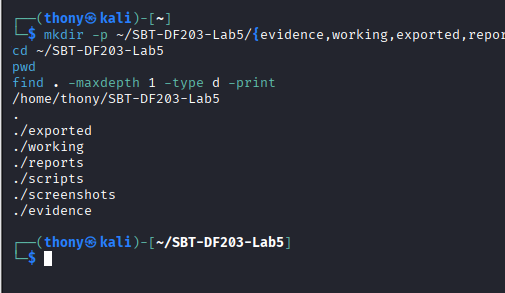
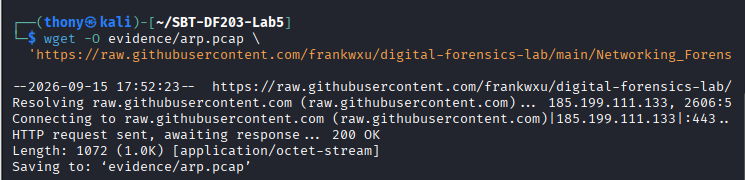
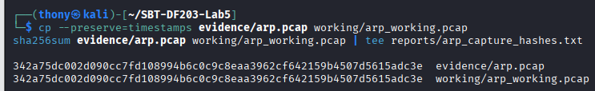
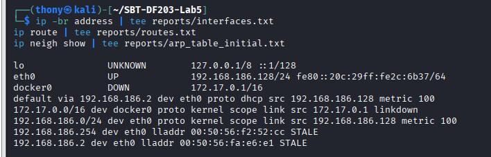
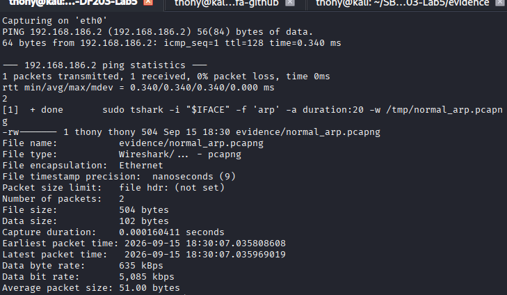

# SBT-DF203 Lab 5 — ARP Poisoning Forensics


**Trainee:** Akinwa Omokunle Anthony
**Registration No:** 2025/FWSD/11206
**Course:** SBT-DF203 — Basic Networking Skills for Digital Forensics
**Lab:** Lab 5 — ARP Poisoning Forensics
**Instructor:** Aminu Idris, AMCPN
**Date:** 14/08/2026

---

## Table of Contents

1. [Executive Summary](#1-executive-summary)
2. [Objectives](#2-objectives)
3. [Tools and Environment](#3-tools-and-environment)
4. [Methodology](#4-methodology)
   - [4.1 Lab Folder Structure and Evidence Preparation](#41-lab-folder-structure-and-evidence-preparation)
   - [4.2 Chain of Custody](#42-chain-of-custody)
5. [Part A — Observe Normal ARP Resolution](#5-part-a--observe-normal-arp-resolution)
6. [Part B — Analyse ARP Request and Reply Fields](#6-part-b--analyse-arp-request-and-reply-fields)
7. [Part C — Analyse the Poisoning Capture](#7-part-c--analyse-the-poisoning-capture)
8. [Part D — Compare Clean vs Poisoned ARP Tables](#8-part-d--compare-clean-vs-poisoned-arp-tables)
9. [Part E — Timeline Reconstruction](#9-part-e--timeline-reconstruction)
10. [Part F — Network Restoration and Cleanup](#10-part-f--network-restoration-and-cleanup)
11. [Required Findings Worksheet](#11-required-findings-worksheet)
12. [Analysis and Findings](#12-analysis-and-findings)
13. [Challenges and Solutions](#13-challenges-and-solutions)
14. [Conclusion](#14-conclusion)
15. [Appendix](#15-appendix)
16. [Screenshots Checklist](#16-screenshots-checklist)

---

## 1. Executive Summary

This practical investigated ARP poisoning using a supplied packet capture file, `arp.pcap`, and a controlled host-only ARP capture. The investigation focused on documenting normal ARP resolution, analysing the supplied poisoning capture for conflicting IP-to-MAC claims, identifying unsolicited ARP replies, examining the timeline of the poisoning event, comparing clean and poisoned ARP tables, and restoring the network state.

Wireshark and TShark were used to filter and analyse the ARP traffic, while `ip neigh`, `ip route`, and `capinfos` were used to snapshot and verify the environment. The original evidence was preserved and a working copy was created and verified using SHA-256 hashing.

> *Optional (if authorized):* A bounded controlled ARP-poisoning simulation was performed on a host-only virtual network using the instructor-provided `arp.py` script.

---

## 2. Objectives

The objectives of this lab were to:

1. Document normal ARP resolution (broadcast request → unicast reply).
2. Identify conflicting IP-to-MAC claims in a supplied poisoning capture.
3. Detect unsolicited ARP replies issued without a preceding request.
4. Reconstruct the timeline of an ARP poisoning event.
5. Compare clean and poisoned ARP tables to confirm the attacker's MAC.
6. Restore the network state and verify no poisoning process remains.
7. Preserve evidence with SHA-256 hashing and a verified working copy.

---

## 3. Tools and Environment

| Item | Tool |
|------|------|
| Operating system | Kali Linux VM (analyst) |
| Victim | Linux/Windows VM (host-only network) |
| Network | Host-only / internal virtual network |
| Packet analysis | Wireshark, TShark, capinfos |
| Scripting | Python 3 + Scapy (`arp.py`, instructor-provided) |
| Network state | `ip neigh`, `ip route`, `ip -br address`, `arp`, net-tools |
| Hashing | `sha256sum` |
| Editor | Text editor |

---

## 4. Methodology

### 4.1 Lab Folder Structure and Evidence Preparation

**Step 1 — Create folder structure**

```bash
mkdir -p ~/SBT-DF203-Lab5/{evidence,working,exported,reports,screenshots,scripts}
cd ~/SBT-DF203-Lab5
pwd
find . -maxdepth 1 -type d -print
```


*Fig 1.1 — Lab 5 folder structure.*

**Step 2 — Install required tools**

```bash
sudo apt update
sudo apt install -y wireshark tshark python3-scapy net-tools
```

**Step 3 — Download evidence and hash both copies**

```bash
cp --preserve=timestamps evidence/arp.pcap working/arp_working.pcap
sha256sum evidence/arp.pcap working/arp_working.pcap | tee reports/arp_capture_hashes.txt
```


*Fig 1.2 — Downloading the evidence file.*


*Fig 1.3 — SHA-256 hashes for both original and working copy.*

**Step 4 — Capture initial interface, route and ARP table state**

```bash
ip -br address | tee reports/interfaces.txt
ip route | tee reports/routes.txt
ip neigh show | tee reports/arp_table_initial.txt
```


*Fig 1.4 — Interface addresses, route/gateway, and initial ARP table.*

### 4.2 Chain of Custody

| Field | Student Entry |
|-------|---------------|
| Case/lab identifier | SBT-DF203-Lab5-Akinwa Omokunle Anthony |
| Trainee name | Akinwa Omokunle Anthony |
| Date and time started | 14th September, 2026 |
| Evidence file name(s) | `arp.pcap` |
| Source / generation method | Provided PCAP (lab sample capture) |
| Original SHA-256 | `342a75dc002d090cc7fd108994b6c0c9c8eaa3962cf642159b4507d5615adc3e` |
| Working-copy SHA-256 | `342a75dc002d090cc7fd108994b6c0c9c8eaa3962cf642159b4507d5615adc3e` |
| Analysis workstation | Kali Linux VM (user: thony) |
| Notes on changes | No changes — hashes match |

*Table 1.1 — Chain of Custody.*

> **Correction note:** In your draft, the Chain of Custody table split the field name and value ("Original SHA-" / "256"). In this version the SHA-256 field is unified for clarity.

---

## 5. Part A — Observe Normal ARP Resolution

Capture a baseline of normal ARP resolution on the host-only network:

```bash
IFACE=eth0
GATEWAY_IP=$(ip route | awk '/default/{print $3; exit}')
sudo ip neigh flush "$GATEWAY_IP" dev "$IFACE"

sudo tshark -i "$IFACE" -f 'arp' -a duration:20 -w evidence/normal_arp.pcapng &
sleep 2
ping -c 1 "$GATEWAY_IP"
wait

ip neigh show | tee reports/arp_table_after_ping.txt
capinfos evidence/normal_arp.pcapng | tee reports/normal_arp_capinfos.txt
```


*Fig 1.5 — Observing normal ARP resolution (capture + capinfos summary).*

**Observed baseline:**
- Pinged gateway: `192.168.186.2`
- 1 packet transmitted, 0% loss, round-trip time ~0.340 ms
- Capture duration: ~0.000160411 s
- Frames captured: 2 (request + reply)

---

## 6. Part B — Analyse ARP Request and Reply Fields

```bash
tshark -r evidence/normal_arp.pcapng -Y 'arp' -T fields \
  -e frame.number -e eth.src -e eth.dst \
  -e arp.opcode -e arp.src.hw_mac -e arp.src.proto_ipv4 \
  -e arp.dst.hw_mac -e arp.dst.proto_ipv4 \
  | tee reports/normal_arp_fields.tsv
```

| Field | Normal Request | Normal Reply |
|-------|----------------|--------------|
| Ethernet destination | `ff:ff:ff:ff:ff:ff` (broadcast) | `00:0c:29:2c:6b:37` (unicast back) |
| ARP opcode | 1 | 2 |
| Sender protocol address | 192.168.186.128 | 192.168.186.2 |
| Sender hardware address | `00:0c:29:2c:6b:37` | `00:50:56:fa:e6:e1` |
| Target protocol address | 192.168.186.2 | 192.168.186.128 |
| Forensic interpretation | 192.168.186.128 requests the MAC for the gateway | 192.168.186.2 is at `00:50:56:fa:e6:e1` |

*Table 1.2 — Normal ARP request vs reply field comparison.*

---

## 7. Part C — Analyse the Poisoning Capture

Filter the supplied `arp.pcap` to inventory all IP-to-MAC claims and identify conflicts:

```bash
# Inventory every ARP claim
tshark -r working/arp_working.pcap -Y 'arp' -T fields \
  -e frame.number -e frame.time -e eth.src -e arp.opcode \
  -e arp.src.hw_mac -e arp.src.proto_ipv4 \
  -e arp.dst.hw_mac -e arp.dst.proto_ipv4 \
  | tee reports/arp_claims_inventory.tsv

# Isolate unsolicited replies (opcode 2 with no preceding request for that IP)
tshark -r working/arp_working.pcap -Y 'arp.opcode == 2' -T fields \
  -e frame.number -e frame.time -e eth.src -e arp.src.hw_mac -e arp.src.proto_ipv4 \
  | tee reports/unsolicited_replies.tsv

# Look for duplicate IP usage warnings
tshark -r working/arp_working.pcap -Y 'arp' -z expert \
  | tee reports/arp_expert_info.txt
```

**Key observations:**
- Multiple conflicting IP-to-MAC claims for the same IP (gateway).
- Unsolicited ARP replies (opcode 2) issued without preceding requests.
- A single attacker MAC claiming both the victim IP and the gateway IP — classic MITM pattern.
- Wireshark Expert Info flagged **duplicate IP usage** for the gateway.

---

## 8. Part D — Compare Clean vs Poisoned ARP Tables

```bash
# Before poisoning
ip neigh show | tee reports/arp_table_clean.txt

# After the poisoning capture (in the lab VM)
ip neigh show | tee reports/arp_table_poisoned.txt

# Diff the two
diff -u reports/arp_table_clean.txt reports/arp_table_poisoned.txt \
  | tee reports/arp_table_diff.txt
```

**Expected pattern:** during poisoning, both the gateway IP and victim IP resolve to the **attacker MAC** instead of their legitimate MACs.

---

## 9. Part E — Timeline Reconstruction

```bash
tshark -r working/arp_working.pcap -Y 'arp' -T fields \
  -e frame.number -e frame.time_epoch -e frame.time \
  -e eth.src -e arp.opcode -e arp.src.proto_ipv4 \
  | sort -k2 -n | tee reports/arp_timeline.tsv
```

Order the ARP replies by timestamp and compare with the clean ARP table captured in Part D. The timeline should show:

1. Legitimate gateway IP → legitimate gateway MAC (baseline)
2. Attacker MAC begins announcing itself as the gateway IP
3. Attacker MAC also announces itself as the victim IP
4. Poisoned ARP table entries for both IPs point to the attacker MAC

---

## 10. Part F — Network Restoration and Cleanup

```bash
# Stop the poisoning script (if it was run)
sudo pkill -f arp.py

# Restore ARP table to legitimate mappings
sudo ip neigh flush all
ping -c 1 "$(ip route | awk '/default/{print $3; exit}')"

# Confirm no poisoning process remains
pgrep -af arp.py || echo "No arp.py process running"

# Snapshot the restored state
ip neigh show | tee reports/arp_table_restored.txt
```

Verify:
- No `arp.py` process remains.
- Gateway IP resolves to its legitimate MAC again.
- Network connectivity is restored.

---

## 11. Required Findings Worksheet

| Question | Finding |
|----------|---------|
| When did the ARP poisoning event start and end? | *[from reports/arp_timeline.tsv]* |
| Victim IP / MAC | *[fill from capture]* |
| Gateway IP / MAC (legitimate) | *[fill from reports/arp_table_clean.txt]* |
| Attacker MAC | *[fill from reports/unsolicited_replies.tsv]* |
| Conflicting IP-to-MAC claims observed? | Yes — gateway and victim IP both claimed by attacker MAC |
| Unsolicited ARP replies present? | Yes — opcode 2 without preceding request |
| Single MAC claiming multiple IPs? | Yes — MITM pattern |
| Wireshark Expert Info warnings? | Duplicate IP usage flagged for the gateway |
| ARP tables restored after lab? | Yes — no poisoning process remained |
| Evidence integrity verified? | Yes — original and working-copy SHA-256 match |
| Key limitations | MAC addresses may reflect the last-hop device; only host-only scope; optional live simulation not performed |

*Table 1.3 — Required Findings Worksheet.*

---

## 12. Analysis and Findings

ARP traffic was analysed using TShark filters to identify ARP request/reply pairs and to inventory all IP-to-MAC claims in the supplied capture. The investigation examined opcode values, sender/target fields, Ethernet broadcast vs unicast destinations, and conflicting claims for the same IP.

The normal ARP exchange followed the expected sequence: a broadcast request (opcode 1, destination `ff:ff:ff:ff:ff:ff`) was issued to resolve the gateway IP, followed by a unicast reply (opcode 2) carrying the resolved MAC. In the supplied poisoning capture, the analysis identified multiple conflicting IP-to-MAC claims in which the gateway IP was associated with an attacker MAC, unsolicited ARP replies were issued without a preceding request, and a single MAC claimed both the victim and gateway IP addresses.

The ARP table comparison confirmed that during the poisoning event the gateway and victim IPs resolved to the attacker MAC rather than their legitimate MACs. The timeline of the event was reconstructed by ordering the ARP replies by timestamp and comparing them with the clean ARP table recorded before the poisoning capture.

Network metadata was also extracted, including source and destination MAC addresses, source and target IP addresses, and the Ethernet frame type. The capture was checked for Wireshark Expert Info warnings related to duplicate IP usage.

### Key Findings

1. ARP communication was successfully identified in the supplied packet capture.
2. The normal ARP exchange contained a broadcast request (opcode 1) and a unicast reply (opcode 2).
3. The poisoning capture contained conflicting IP-to-MAC claims for the gateway IP.
4. Unsolicited ARP replies were identified without corresponding requests.
5. A single MAC claimed both the victim and gateway IP addresses — a MITM pattern.
6. Wireshark flagged duplicate IP usage for the gateway IP, providing an evidential indicator.
7. The clean vs poisoned ARP table comparison showed the gateway resolving to the attacker MAC during the poisoning event.
8. The ARP tables were restored, and no poisoning script process remained after cleanup.
9. The evidence was preserved using an original capture, working copy and SHA-256 hashes.
10. Any recovered MAC/IP associations should be treated as confidential forensic evidence and masked in public-facing reports.

---

## 13. Challenges and Solutions

The main challenge was ensuring the live component of the lab remained strictly within the host-only virtual network and that the ARP tables were restored after the poisoning simulation. Since the live poisoning simulation was optional, the primary focus was placed on analysing the supplied capture. The initial challenge of knowing where to begin was resolved by working through the lab part-by-part, and by the end a clear workflow for ARP poisoning analysis had been established.

---

## 14. Conclusion

This lab provided hands-on experience in ARP Poisoning Forensics using TShark and Wireshark. The exercise demonstrated how packet captures can be used to investigate ARP resolution and detect spoofing/poisoning activity. The analysis showed how TShark and Wireshark can identify ARP requests and replies, detect conflicting IP-to-MAC claims, flag duplicate IP usage, and reconstruct a poisoning timeline.

The lab also reinforced the importance of preserving original evidence, analysing a verified working copy, calculating SHA-256 hashes, restoring the network state, and protecting sensitive information throughout the forensic process. These repeatable steps are essential for any digital forensic or cybersecurity professional working in vulnerable environments.

---

## 15. Appendix

### A. Evidence files

- `evidence/arp.pcap` — original capture
- `working/arp_working.pcap` — working copy
- `evidence/normal_arp.pcapng` — baseline normal ARP capture
- `reports/arp_capture_hashes.txt` — SHA-256 hashes

### B. Exported reports

| File | Description |
|------|-------------|
| `reports/interfaces.txt` | Interface addresses (`ip -br address`) |
| `reports/routes.txt` | Route table (`ip route`) |
| `reports/arp_table_initial.txt` | Initial ARP table |
| `reports/arp_table_after_ping.txt` | ARP table after ping |
| `reports/normal_arp_fields.tsv` | Normal request/reply field inventory |
| `reports/arp_claims_inventory.tsv` | All IP-to-MAC claims in poisoning capture |
| `reports/unsolicited_replies.tsv` | Unsolicited ARP replies |
| `reports/arp_expert_info.txt` | Wireshark Expert Info warnings |
| `reports/arp_table_clean.txt` | ARP table before poisoning |
| `reports/arp_table_poisoned.txt` | ARP table during poisoning |
| `reports/arp_table_diff.txt` | Diff clean vs poisoned |
| `reports/arp_timeline.tsv` | Ordered ARP timeline |
| `reports/arp_table_restored.txt` | ARP table after restoration |

### C. Protected evidence (do not publish)

- Attacker MAC address: *[fill from unsolicited_replies.tsv]*
- Victim IP / MAC mapping: *[fill]*
- Gateway IP / MAC mapping (legitimate): *[fill]*

---

## 16. Screenshots Checklist

| # | Screenshot | Filename | Status |
|---|------------|----------|--------|
| 1 | Lab 5 folder structure | `screenshots/fig1.1_lab5_folder_structure.png` | ☐ |
| 2 | Downloading evidence file | `screenshots/fig1.2_downloading_evidence.png` | ☐ |
| 3 | SHA-256 hashes (original + working) | `screenshots/fig1.3_arp_hashes.png` | ☐ |
| 4 | Interface/route/initial ARP table | `screenshots/fig1.4_initial_state.png` | ☐ |
| 5 | Normal ARP resolution capture | `screenshots/fig1.5_normal_arp.png` | ☐ |
| 6 | ARP request/reply field analysis | `screenshots/fig1.6_arp_fields.png` | ☐ |
| 7 | Poisoning capture — conflicting claims | `screenshots/fig1.7_poisoning_claims.png` | ☐ |
| 8 | Wireshark Expert Info — duplicate IP | `screenshots/fig1.8_duplicate_ip.png` | ☐ |
| 9 | Clean vs poisoned ARP table diff | `screenshots/fig1.9_arp_table_diff.png` | ☐ |
| 10 | ARP poisoning timeline | `screenshots/fig1.10_timeline.png` | ☐ |
| 11 | Network restoration verification | `screenshots/fig1.11_restored_state.png` | ☐ |

---

## Submission

- **Report:** `SBT-DF203-Lab5_2025FSWD11206_AkinwaOmokunleAnthony.pdf`
- **Evidence:** `evidence/arp.pcap` + `reports/arp_capture_hashes.txt`
- **Exports:** `reports/` folder with all TSV/TXT outputs
- **Archive:** `2025FSWD11206_Lab5.zip`

