# SBT-DF203 — Lab 6: Firewall Traffic Control and Forensic Verification

**Course:** Basic Networking Skills for Digital Forensics  
**Course Code:** SBT-DF203  
**Lab Number:** Lab 6  
**Prepared by:** Aminu Idris, AMCPN — Founder, ICDFA  
**Analyst:** Akinwa Omokunle Anthony — 2025/FWSD/11206  
**Analysis Workstation:** Kali Linux VM (`192.168.186.128`, `eth0`)

---

## Executive Summary

This practical validated a Linux host-based firewall's ability to control HTTP traffic from one authorized lab client while allowing another. The lab used an isolated host-only VMnet8 network comprising a Kali Linux VM acting as the protected server and a Windows client VM acting as the requesting host. Apache 2.4.68 (Debian) served a training page. TShark captured baseline allowed HTTP traffic and then blocked traffic after a narrowly scoped `iptables` INPUT rule was inserted. The rule was applied only to the assigned blocked client IP, verified with `iptables -C`, and removed after evidence collection.

---

## 1. Lab Folder Structure

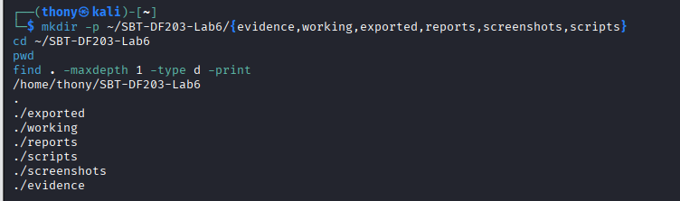

*Fig 1.1 — Lab 6 folder structure*

---

## 2. Training Webpage Served by Apache

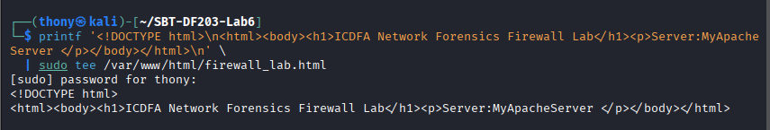

*Fig 1.2 — Training webpage served by Apache*

---

## 3. Evidence Integrity and Chain of Custody

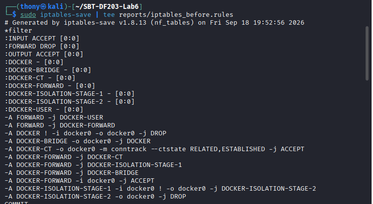

*Fig 1.3 — The `iptables-save` output (ruleset file)*

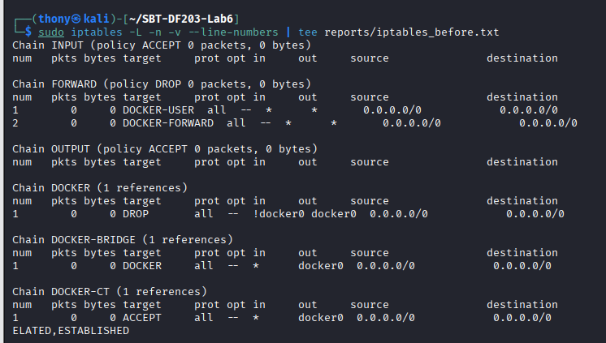

*Fig 1.4 — Original iptables listing*

Original ruleset SHA-256:
b8c6e01285998f85ca87dadb5852a8c714da0afedd120a06c8dbc444753a44fb reports/iptables_before.rules

text

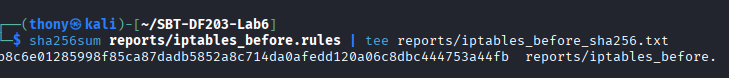

*Fig 1.5 — SHA-256 of the exported ruleset*

### Mini Chain of Custody

| Field | Value |
|---|---|
| Case/lab identifier | SBT-DF203-Lab6-AkinwaOmokunleAnthony |
| Trainee name | Akinwa Omokunle Anthony |
| Date and time started | 18th September, 2026, 19:52 WAT |
| Evidence files | `iptables_before.rules`, `iptables_before.txt`, `http_allowed.pcapng`, `http_blocked.pcapng`, `allowed_vs_blocked.tsv` |
| Original SHA-256 | `b8c6e01285998f85ca87dadb5852a8c714da0afedd120a06c8dbc444753a44fb` |
| Analysis workstation | Kali Linux VM — `eth0`, MAC `00:0c:29:2c:6b:37` |
| Client VM | Windows — `192.168.186.1` (VMnet8) |
| Gateway | `192.168.186.2` |

---

## 4. Part A — Baseline Access

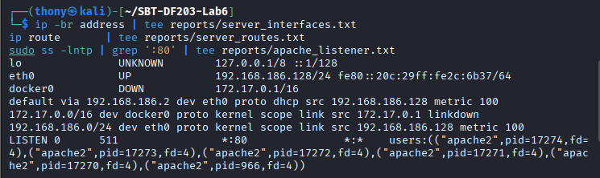

*Fig 2.1 — Server interfaces, routes, and Apache listener*

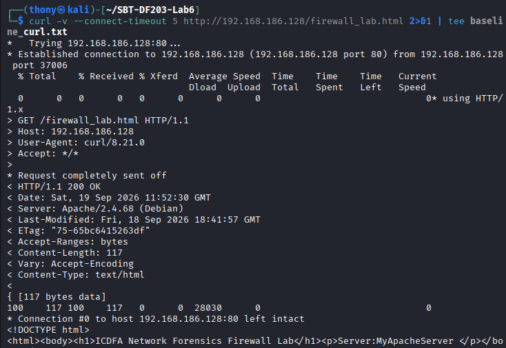

*Fig 2.2 — Baseline `curl -v` success from client*

| Field | Value |
|---|---|
| Server IP | `192.168.186.128` |
| Server interface | `eth0` |
| Client IP | `192.168.186.1` |
| Baseline result | `HTTP/1.1 200 OK` |

---

## 5. Part B — Capture the Allowed HTTP Baseline

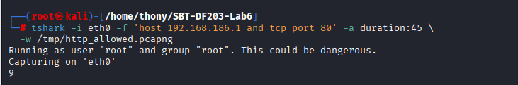

*Fig 2.3 — Start of the allowed capture (foreground)*

Hash of the allowed capture:
bdb691732c8d3023068c04b16ae5ca2414931467ef5aa127d478de2561a2809d evidence/http_allowed.pcapng

text

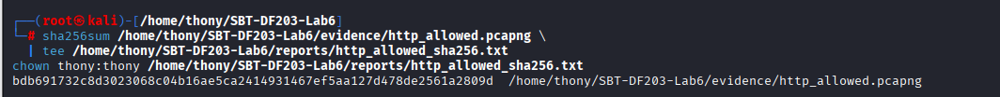

*Fig 2.4 — Hash of the allowed capture*

---

## 6. Part C — Apply and Verify the Blocking Rule

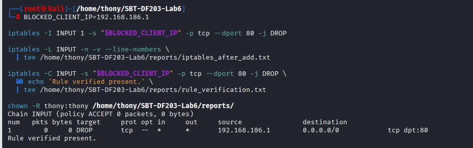

*Fig 3.1 — `iptables -L INPUT` after adding the DROP rule*

| Field | Value |
|---|---|
| Rule position | INPUT chain, line 1 |
| Source | `192.168.186.1` |
| Protocol / port | TCP / 80 |
| Target | `DROP` |

---

## 7. Part D — Capture Blocked Traffic and Rule Counters

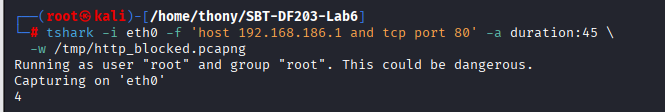

*Fig 4.1 — Wireshark blocked capture showing SYN retransmissions*

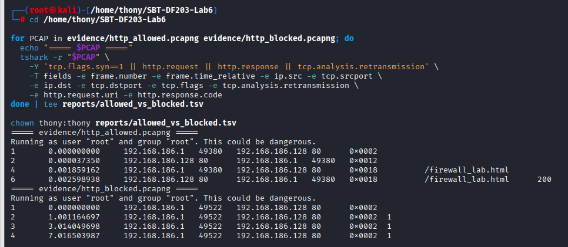

*Fig 4.2 — Windows client output after blocked*

Blocked capture SHA-256:
24352948613f9920932b8f812fd62326a1c9c42fb2af63c5ee31cddc440d9d7e evidence/http_blocked.pcapng

text

---

## 8. Part E — Compare Allowed and Blocked Captures

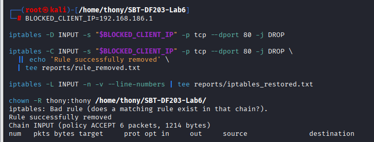

*Fig 5.1 — Compare both captures*

| Indicator | Allowed | Blocked |
|---|---|---|
| Client SYN visible | Yes | Yes |
| Server SYN-ACK visible | Yes | No |
| Handshake complete | Yes | No |
| HTTP GET visible | Yes | No |
| HTTP response visible | Yes (`HTTP/1.1 200 OK`) | No |
| Retransmissions / timeouts | None | Repeated SYN retransmissions |
| iptables counter change | 0 | 4 packets matched |
| curl result | `200 OK` | `curl: (28) Timeout was reached` |

---

## 9. Part F — Remove the Rule and Restore Access

```bash
iptables -D INPUT -s 192.168.186.1 -p tcp --dport 80 -j DROP
The INPUT chain returned to baseline and HTTP access was restored from the Windows client.

10. Forensic Interpretation Questions
1. Why does DROP cause SYN retransmissions and a timeout?
DROP silently discards the SYN with no reply. TCP retransmits with exponential backoff until the connect timer expires.

2. How would REJECT differ in the capture and client output?
REJECT actively replies — with ICMP unreachable the client fails fast with "Connection refused"; with TCP RST, "Connection reset by peer".

3. Why are firewall counters valuable corroborating evidence?
Counters prove the rule matched live traffic. Without them, a blocked SYN could also be explained by a down server or broken route.

4. What evidence would show the web server was down rather than firewall-blocked?
A down server's host stack replies with a TCP RST (no listener) or nothing (host offline), and no iptables counter increments. Firewall-blocked traffic shows SYN arriving with no RST/ICMP, no SYN-ACK, and the DROP counter incrementing.

5. Risk of deleting a rule by line number after other rules changed?
iptables -D INPUT <line> deletes whatever currently occupies that position. Delete by specification instead.

11. Key Findings
A source-specific DROP rule at the top of INPUT blocked HTTP from one client without affecting other traffic.

DROP caused the client to time out because packets were silently discarded.

The block was visible in three independent places — capture, firewall counter, client output.

Firewall counters are essential corroborating evidence.

An empty SYN capture without SYN-ACK does not on its own prove a firewall block.

The original ruleset was preserved and hashed before any change.

12. References
ICDFA SBT-DF203 — Lab 6: Firewall Traffic Control and Forensic Verification.

iptables(8), iptables-save(8) man pages.

RFC 793 — TCP. RFC 792 — ICMP.

Wireshark filter reference — tcp.flags, tcp.analysis.retransmission, http.*.
