# SBT-DF203 — Lab 7: DNS Introduction and Traffic Analysis

**Course:** Basic Networking Skills for Digital Forensics  
**Course Code:** SBT-DF203  
**Lab Number:** Lab 7  
**Lab Title:** DNS Introduction and Traffic Analysis  
**Delivery Block:** 3/3 of 3  
**Scheduled Dates:** 19–25 September 2026  
**Prepared by:** Aminu Idris, AMCPN — Founder, ICDFA  
**Analyst:** Akinwa Omokunle Anthony — 2025/FWSD/11206  
**Analysis Workstation:** Kali Linux VM (`192.168.186.128`, `eth0`)

---

## Executive Summary

This practical documented normal Domain Name System (DNS) behaviour for an incident-response baseline. Controlled queries were issued with `dig` for A, AAAA, MX and NS records, and live DNS traffic was captured with `tshark` on an isolated lab network. The full two-hop resolution chain — local systemd-resolved stub (`127.0.0.53`) to upstream resolver (`192.168.186.2`) — was captured and analysed, including transaction IDs, query names, record types, response codes, answer IPs, TTLs and timing. A browser session to `https://example.com` was captured to inventory the DNS lookups Firefox generates in the background, and DNS answers were correlated with subsequent TCP and QUIC connections. DNS resolution from the Lab 4 SMTP capture was also analysed, showing a clean causal chain between `mail.patriots.in → 74.53.140.153` and the subsequent SMTP session. The original evidence was preserved and verified with SHA-256 hashing.

---

## Objectives

1. Explain recursive and iterative DNS resolution at a foundational level.
2. Use `dig` to query A, AAAA, MX and NS records for a selected domain.
3. Capture and analyse DNS queries and responses with `tshark` and Wireshark.
4. Identify the transaction ID, query name, record type, response code, answer IP(s) and TTL in live DNS traffic.
5. Correlate DNS responses with later IP connections made by the client.
6. Recognise normal DNS variations such as multiple answers, CNAME chains, cache responses and IPv6 queries.
7. Document normal DNS behaviour as a baseline for incident response and the future spoofing analysis in Lab 8.

---

## Tools Used and Resources

| Tool / Resource | Purpose |
|---|---|
| Kali Linux VM (`192.168.186.128`) | Generate and analyse DNS traffic |
| `dig` (dnsutils 9.20.27) | Issue controlled queries for A, AAAA, MX, NS |
| `tshark` / Wireshark | Capture and analyse DNS packets |
| `capinfos` | Summarise capture metadata |
| `sha256sum` | Verify evidence integrity |
| `/etc/resolv.conf`, `resolvectl` | Identify configured and upstream resolvers |
| Firefox | Generate browser-driven DNS lookups |
| VMware host-only / NAT network | Isolated lab environment |

---

## 1. Lab Folder Structure

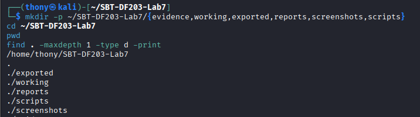

*Fig 1.1 — Lab 7 folder structure*

---

## 2. Resolver Configuration


*Fig 1.2 — Configured and upstream resolvers*

| Field | Value |
|---|---|
| `/etc/resolv.conf` nameserver | `127.0.0.53` (systemd-resolved stub) |
| Upstream DNS server (eth0) | `192.168.186.2` |
| Search domain | `localdomain` |
| resolv.conf mode | stub |
| DNSSEC | no / unsupported |

---

## 3. Evidence Integrity and Chain of Custody


*Fig 1.3 — SHA-256 hashes of original and working copy*

```
76172d8697705df475ec6cc96fdcccbf1f8c14922ef3a38bc87455c623ad4e36  evidence/dig_dns.pcap
76172d8697705df475ec6cc96fdcccbf1f8c14922ef3a38bc87455c623ad4e36  working/dig_dns_working.pcap
```


*Fig 1.4 — capinfos summary of dig_dns.pcap*

### Mini Chain of Custody

| Field | Value |
|---|---|
| Case/lab identifier | SBT-DF203-Lab7-AkinwaOmokunleAnthony |
| Trainee name | Akinwa Omokunle Anthony |
| Date and time started | 19th September, 2026 |
| Evidence files | `dig_dns.pcap`, `fresh_dig_dns.pcapng`, `browser_dns.pcapng`, `smtp_dns_correlation.tsv` |
| Source | Generated in controlled host-only lab network |
| Original SHA-256 (dig_dns.pcap) | `76172d8697705df475ec6cc96fdcccbf1f8c14922ef3a38bc87455c623ad4e36` |
| Working-copy SHA-256 | Same — original preserved |
| Analysis workstation | Kali Linux VM, interface `eth0` |
| Notes | No changes to source evidence |

---

## 4. Part A — Query DNS Records with dig

### A Record

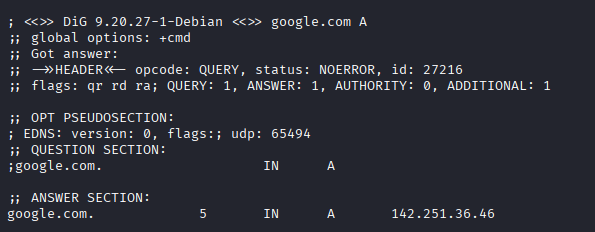

*Fig 2.1 — `dig google.com A` output*

### AAAA Record

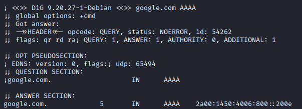

*Fig 2.2 — `dig google.com AAAA` output*

### MX Record

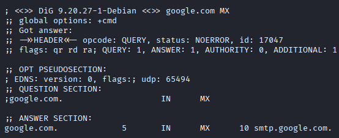

*Fig 2.3 — `dig google.com MX` output*

### NS Record

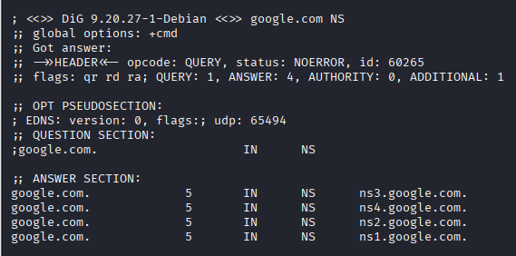

*Fig 2.4 — `dig google.com NS` output*

### Record-Type Results Summary

| Query | Type | TXID | Status | Flags | Answers | Answer(s) | TTL | Query time |
|---|---|---|---|---|---|---|---|---|
| `google.com` | A | 27216 | NOERROR | qr rd ra | 1 | `142.251.36.46` | 5 | 643 ms |
| `google.com` | AAAA | 54262 | NOERROR | qr rd ra | 1 | `2a00:1450:4006:800::200e` | 5 | 751 ms |
| `google.com` | MX | 17047 | NOERROR | qr rd ra | 1 | `10 smtp.google.com.` | 5 | 3738 ms |
| `google.com` | NS | 60265 | NOERROR | qr rd ra | 4 | `ns1–ns4.google.com.` | 5 | 1435 ms |
| `google.com` (+short) | A | — | — | — | 1 | `142.251.36.46` | — | — |

### Explanation of Record Types

- **IN** — Internet class, standard for public DNS records.
- **A** — Maps a name to an IPv4 address (e.g., `142.251.36.46`).
- **AAAA** — Maps a name to an IPv6 address (e.g., `2a00:1450:4006:800::200e`).
- **MX** — Mail exchange record; `10` is the preference number (lower = higher priority).
- **NS** — Authoritative name server for the zone.
- **TTL = 5** — Cache lifetime. The record may be cached for 5 seconds, after which the resolver must re-query. It is a cache control, not a record creation or expiry date.

---

## 5. Part B — Capture Fresh DNS on the Wire

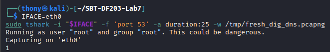

*Fig 3.1 — Fresh DNS capture and dig query*

| Field | Value |
|---|---|
| Capture file | `evidence/fresh_dig_dns.pcapng` |
| SHA-256 | `2919710d931f667f15a4d8804dd8a23e95f2293025d3ee0ebc10f96f2225ebf2` |
| Packets | 8 (two query/response pairs — stub and upstream) |
| Duration | 11.3 seconds |
| Filter | `port 53` |

---

## 6. Part C — Query and Response Fields

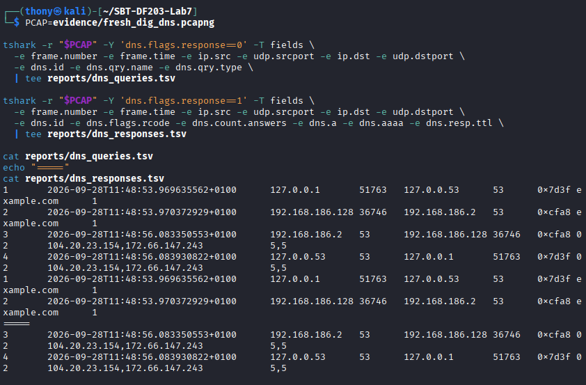

*Fig 4.1 — Query and response field extraction*

### Queries (`dns.flags.response==0`)

| Frame | Time | Client | Src Port | Resolver | Dst Port | TXID | Query Name | Type |
|---|---|---|---|---|---|---|---|---|
| 1 | 11:48:53.969635 | `127.0.0.1` | 51763 | `127.0.0.53` | 53 | `0x7d3f` | `example.com` | 1 (A) |
| 2 | 11:48:53.970372 | `192.168.186.128` | 36746 | `192.168.186.2` | 53 | `0xcfa8` | `example.com` | 1 (A) |

### Responses (`dns.flags.response==1`)

| Frame | Time | Resolver | Src Port | Client | Dst Port | TXID | rcode | Answers | Answer IPs | TTLs |
|---|---|---|---|---|---|---|---|---|---|---|
| 3 | 11:48:56.083350 | `192.168.186.2` | 53 | `192.168.186.128` | 36746 | `0xcfa8` | 0 (NOERROR) | 2 | `104.20.23.154`, `172.66.147.243` | 5, 5 |
| 4 | 11:48:56.083930 | `127.0.0.53` | 53 | `127.0.0.1` | 51763 | `0x7d3f` | 0 (NOERROR) | 2 | `104.20.23.154`, `172.66.147.243` | 5, 5 |

**Interpretation:** Two-hop recursion. Frame 1 is the local dig asking the systemd-resolved stub. Frame 2 is the stub asking the upstream VMware NAT resolver. Frames 3 and 4 are the responses on each hop. Both hops return the same two A records with TTL 5 seconds.

---

## 7. Part D — Match Queries to Responses

### Pair 1 — Stub ↔ Upstream (TXID `0xcfa8`)

| Field | Value |
|---|---|
| Transaction ID | `0xcfa8` |
| Query Name | `example.com` |
| Type | A (1) |
| Client (query) | `192.168.186.128:36746` |
| Resolver (response) | `192.168.186.2:53` |
| Response Code | 0 = NOERROR |
| Answer(s) | `104.20.23.154`, `172.66.147.243` |
| TTL | 5s, 5s |
| Query → Response Δ | 2.113 s |

### Pair 2 — Local dig ↔ Stub (TXID `0x7d3f`)

| Field | Value |
|---|---|
| Transaction ID | `0x7d3f` |
| Query Name | `example.com` |
| Type | A (1) |
| Client (query) | `127.0.0.1:51763` |
| Resolver (response) | `127.0.0.53:53` |
| Response Code | 0 = NOERROR |
| Answer(s) | `104.20.23.154`, `172.66.147.243` |
| TTL | 5s, 5s |
| Query → Response Δ | 2.114 s |

**Observation:** The stub and upstream use **different transaction IDs** (`0x7d3f` and `0xcfa8`). Matching must be done on the **endpoint tuple**, not on TXID alone.

---

## 8. Part E — DNS Generated by a Browser

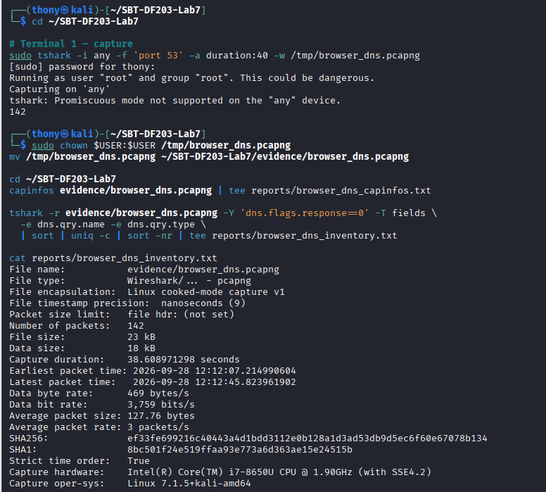

*Fig 5.1 — Browser DNS query inventory*

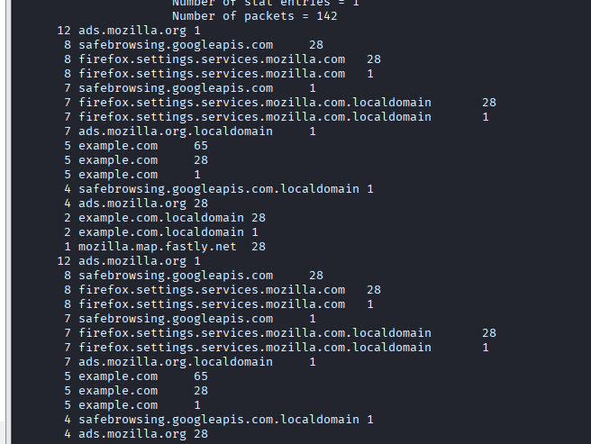

*Fig 5.2 — Browser DNS grouped by domain*

| Field | Value |
|---|---|
| Capture file | `evidence/browser_dns.pcapng` |
| SHA-256 | `ef33fe699216c40443a4d1bdd3112e0b128a1d3ad53db9d5ec6f60e67078b134` |
| Packets | 142 |
| Duration | 38.6 seconds |
| Capture interface | `any` (Linux SLL) |
| Filter | `port 53` |

### Domain Inventory

| Domain | Query Count | Notes |
|---|---|---|
| `ads.mozilla.org` | 12 + 4 | Firefox telemetry |
| `safebrowsing.googleapis.com` | 8 + 7 | Google Safe Browsing lookups |
| `firefox.settings.services.mozilla.com` | 8 + 8 + 7 | Firefox remote settings |
| `firefox.settings.services.mozilla.com.localdomain` | 7 + 7 | Search-domain expansion |
| `ads.mozilla.org.localdomain` | 7 | Search-domain expansion |
| `example.com` | 5 + 5 + 5 | Page visited |
| `safebrowsing.googleapis.com.localdomain` | 4 | Search-domain expansion |
| `example.com.localdomain` | 2 + 2 | Search-domain expansion |
| `mozilla.map.fastly.net` | 1 | CDN endpoint |

**Query types observed:** A (1), AAAA (28), HTTPS/SVCB (65).

**Note on `.localdomain` entries:** These are produced by the `search localdomain` directive in `/etc/resolv.conf`. Firefox tries `name.localdomain` first, gets NXDOMAIN, then queries the real name.

---

## 9. Part F — Correlate DNS with Subsequent Connections

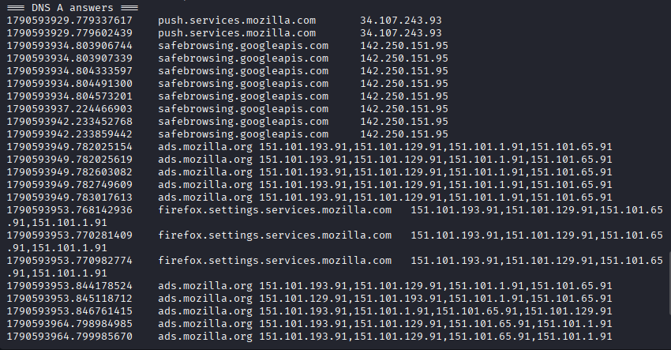

*Fig 6.1 — DNS A answers*

### DNS A Answers

| Query Name | Answer IP(s) |
|---|---|
| `push.services.mozilla.com` | `34.107.243.93` |
| `safebrowsing.googleapis.com` | `142.250.151.95` |
| `ads.mozilla.org` | `151.101.193.91`, `151.101.129.91`, `151.101.1.91`, `151.101.65.91` |
| `firefox.settings.services.mozilla.com` | Same 4 Fastly IPs |
| `example.com` | `172.66.147.243`, `104.20.23.154` |

### TCP SYN Destinations

**Empty** — no TCP SYN packets matched within the capture window.

### Correlation Table

| DNS Query Name | DNS Answer(s) | TCP SYN Seen? | Match? |
|---|---|---|---|
| `push.services.mozilla.com` | `34.107.243.93` | No | — |
| `safebrowsing.googleapis.com` | `142.250.151.95` | No | — |
| `ads.mozilla.org` | `151.101.x.x` | No | — |
| `firefox.settings.services.mozilla.com` | `151.101.x.x` | No | — |
| `example.com` | `172.66.147.243`, `104.20.23.154` | No | — |

### Mismatch Explanation

No TCP SYN packets appeared that corresponded to the DNS A answers observed. The following normal explanations apply:

1. **Connection establishment precedes the capture window.** Firefox opened many connections at browser start, before the private window and before the capture.
2. **DNS caching with low TTL.** Within the 5-second TTL window, repeated queries use cached answers, so new connections use IPs resolved before the capture started.
3. **CDN anycast and load balancing.** `example.com` returned two A records because it is Cloudflare-fronted; the browser may connect to either.
4. **Connection reuse (HTTP/2, HTTP/3).** A single TCP/QUIC session is reused for many requests to the same CDN.
5. **QUIC / HTTP/3 over UDP 443.** Firefox prefers QUIC, which runs on UDP 443 — a TCP SYN filter will not see it. This is the most likely explanation for `example.com`.
6. **Capture duration and VMware NAT boundary.** Handshakes handled below the capture layer or outside the window would not appear.

The absence of matched SYNs is expected and does **not** indicate DNS failure.

---

## 10. Part G — DNS Analysis Within SMTP Evidence

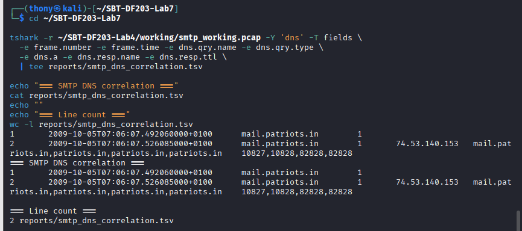

*Fig 7.1 — SMTP DNS correlation*

Using the `smtp_working.pcap` capture from Lab 4, filtering on `dns` produced exactly two frames:

| Frame | Time | Query Name | Type | Answer | Response Chain | TTLs |
|---|---|---|---|---|---|---|
| 1 | 07:06:07.492060 | `mail.patriots.in` | A (1) | *(query — no answer)* | — | — |
| 2 | 07:06:07.526085 | `mail.patriots.in` | A (1) | `74.53.140.153` | `mail.patriots.in`, `patriots.in`, `patriots.in`, `patriots.in` | 10827, 10828, 82828, 82828 |

**Correlation:** The DNS response resolved `mail.patriots.in` to `74.53.140.153` at `07:06:07.526`. The SMTP session began at `07:06:08.219`, using the same IP. That is a **0.69-second causal chain** from DNS resolution to SMTP connection.

**Significance:**

- DNS is a prerequisite for the SMTP session.
- The answer contains a **CNAME chain**, not a direct A record.
- High TTLs (`10827s`, `82828s`) reflect a stable mail server, in contrast to the 5-second TTLs of CDN domains.
- A compromised CNAME target could silently redirect mail — a DNS hijacking pattern.

---

## 11. Required Findings Worksheet

| Field | Finding |
|---|---|
| Configured resolver IP | `127.0.0.53` (stub), upstream `192.168.186.2` |
| Client source port | `51763` (dig→stub), `36746` (stub→upstream) |
| Resolver destination port | `53` (UDP) |
| Transaction ID | `0x7d3f` (dig↔stub), `0xcfa8` (stub↔upstream) |
| Query name and type | `example.com` / A (1); also AAAA, MX, NS, HTTPS/SVCB |
| Response code | 0 = NOERROR |
| Answer IP(s) | `104.20.23.154`, `172.66.147.243` |
| TTL | 5 seconds (cache lifetime, not creation date) |
| Query-response time delta | 2.113 s / 2.114 s |
| Subsequent connection correlation | No TCP match in browser capture; clean SMTP correlation in Part G |
| Normal variations observed | Two-hop resolution; multiple A records; CNAME chain; search-domain expansion; distinct TXIDs per hop; high vs low TTL contrast |

---

## 12. Analysis and Findings

1. **Two-hop resolution** was captured cleanly with distinct TXIDs per hop. The stub generates its own ID when forwarding to upstream, so matching must use the endpoint tuple.
2. **TTL = 5 seconds** on `example.com` reflects a cache lifetime, not a record creation date. CDN-backed domains use very low TTLs to enable fast rotation.
3. **Multiple A records and CNAME chains** are normal for CDN-fronted and mail-alias domains.
4. **One page visit generated ~10 domains of background DNS** — telemetry, Safe Browsing, remote settings, and CDN endpoints all queried by Firefox without user input.
5. **The SMTP DNS correlation (Part G)** proved the causal chain from resolution to connection: `mail.patriots.in → 74.53.140.153` resolved 0.69 s before the SMTP session used that IP.
6. **Absence of TCP SYNs** in the browser correlation is a normal limitation (QUIC, connection reuse, capture timing), not a failure.

---

## 13. Challenges and Solutions

Working on this lab, one challenge was interpreting the two-hop resolution path — the local stub resolver obscured the actual upstream query at first. The solution was to use `tshark -i any` to capture on all interfaces and to identify the stub-to-upstream hop by its distinct transaction ID and endpoint tuple. Another challenge was the empty TCP correlation in Part F, resolved by explaining the QUIC, caching, and connection-reuse factors that make TCP SYN correlation unreliable in modern browsers.

---

## 14. Conclusion

This lab demonstrated DNS traffic analysis using `dig`, `tshark` and Wireshark. The investigation showed a real recursive DNS query travelling from client to stub, then stub to upstream resolver and back, with transaction IDs, flags, response codes, answer IPs and TTLs all extractable from the capture. The `dig` queries returned NOERROR responses for A, AAAA, MX and NS records, and the browser capture showed how a single page visit generates background DNS queries for many domains. The SMTP capture provided the clearest DNS-to-connection correlation: `mail.patriots.in → 74.53.140.153` resolved 0.69 seconds before the SMTP session used that IP. The exercise reinforced the importance of TTL interpretation, CNAME chains, search-domain expansion, and the fact that absence of TCP correlation is a legitimate forensic finding rather than a defect in the data.

---

## 15. References

- ICDFA SBT-DF203 — Lab 7: DNS Introduction and Traffic Analysis.
- RFC 1035 — Domain Names — Implementation and Specification.
- RFC 3596 — DNS Extensions to Support IPv6 (AAAA).
- RFC 9460 — Service Binding and Parameter Specification via the DNS (SVCB/HTTPS).
- `dig(1)`, `tshark(1)`, `resolv.conf(5)`, `resolvectl(1)` man pages.
- Wireshark Display Filter Reference — `dns.qry.name`, `dns.a`, `dns.resp.ttl`, `dns.flags.response`.

---

*Prepared as part of the ICDFA SBT-DF203 three-week delivery block 3/3, 19–25 September 2026.*
