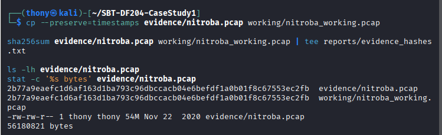
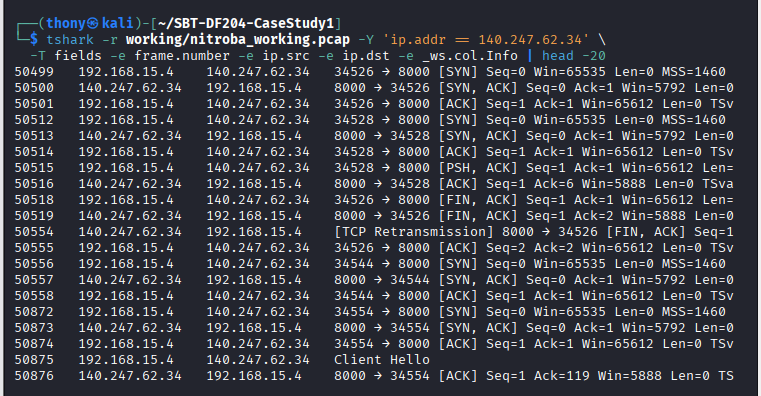
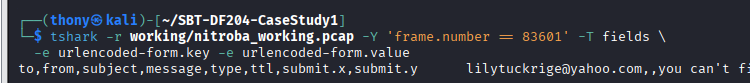
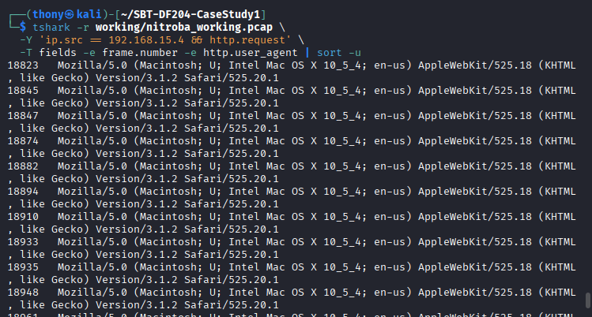
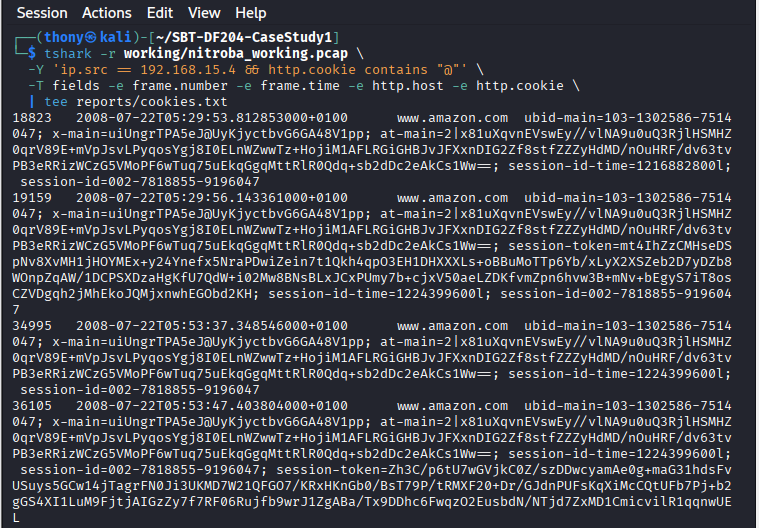
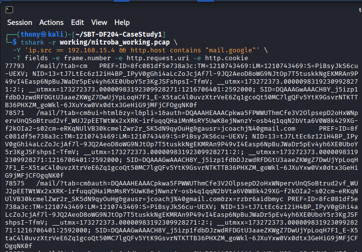
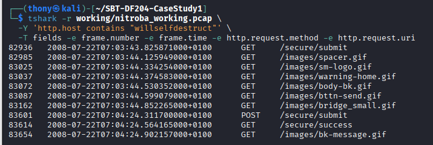

# SBT-DF204 — Case Study 1: Investigating Harassment Email Traffic With Wireshark


**International Cybersecurity and Digital Forensics Academy (ICDFA)**
**School of Basic Vocational Training (SVT)**

| Field | Details |
|---|---|
| Student Name | Akinwa Omokunle Anthony |
| Student ID | 2025/FWSD/11206 |
| Programme | Fellowship in Web Application Security & Digital Forensics |
| Course | SBT-DF204 — Computer Forensics Case Study |
| Case Title | Investigating Harassment Email Traffic With Wireshark |
| Instructor | Aminu Idris, AMCPN |
| Date | 5th October, 2026 |
| Batch | BATCH-B2025 · L1/S2 |

---

## Executive Summary

This case study investigates a packet capture (`nitroba.pcap`) supplied by the Digital Corpora repository in connection with a harassment email incident at Nitroba University. The complainant, Chemistry Department teacher Lily Tuckrige, received a harassing message through the anonymous web service `willselfdestruct.com` on 22 July 2008.

The investigation examines whether the available network evidence supports attribution to a student in Chemistry 109. The workflow covers evidence acquisition and integrity, traffic discovery, message correlation, device analysis, identity analysis, roster comparison, timeline construction, and attribution assessment.

**Key finding:** The device at internal IP `192.168.15.4`, MAC address `00:17:f2:e2:c0:ce`, submitted the harassment message to `willselfdestruct.com`. The HTTP POST form data (frame 83601) contained the recipient `lilytuckrige@yahoo.com`, subject *"you can't find us"*, and the message body. Cookie evidence links the device to `jcoachj@gmail.com`, which pattern-matches to **Johnny Coach** on the Chemistry 109 roster. The shared open Wi-Fi environment limits personal attribution.

**Confidence Level:** High (device attribution); Moderate-to-High (personal attribution).

**Authorization statement:** This case study was completed exclusively offline using the supplied historical training dataset. No live network, host, or account was contacted, and unrelated personal data was redacted.

---

## 1. Executive Conclusion

The network traffic capture supports a **high-confidence** conclusion that the device at internal IP address `192.168.15.4`, bearing MAC address `00:17:f2:e2:c0:ce`, submitted the harassment message to the `willselfdestruct.com` web service. The HTTP POST request (frame 83601) contains form data addressed to `lilytuckrige@yahoo.com` with the subject *"you can't find us"* and the message content *"and you can't hide from us. Stop teaching. Start running."* — matching the reported harassment.

Analysis of the same device's other network traffic reveals a Gmail session cookie containing the email address `jcoachj@gmail.com`, which links the device to **Johnny Coach**, a student on the Chemistry 109 roster.

**Confidence Level:** High — multiple corroborating artefacts (MAC address, HTTP form data, cookie-based identity, roster match) support this conclusion. However, the shared open Wi-Fi router in the dormitory introduces a limitation: the MAC address identifies the device, not necessarily the person operating it at the time of the offence.

---

## 2. Evidence Acquisition and Integrity

### 2.1 Evidence Source

| Field | Value |
|---|---|
| Original File Name | `nitroba.pcap` |
| Source URL | `https://digitalcorpora.s3.amazonaws.com/corpora/scenarios/2008-nitroba/nitroba.pcap` |
| Source Page | `digitalcorpora.org/corpora/scenarios/nitroba-university-harassment-scenario` |
| Download Date | 4th October, 2026 |
| SHA-256 (calculated) | `2b77a9eaefc1d6af163d1ba793c96dbccacb04e6befdf1a0b01f8c67553ec2fb` |
| SHA-256 (published) | `2b77a9eaefc1d6af163d1ba793c96dbccacb04e6befdf1a0b01f8c67553ec2fb` |
| Published Checksum Match? | ✅ Yes — verified match |

### 2.2 Working Copy Creation

```bash
mkdir -p ~/SBT-DF204-CaseStudy1/{evidence,working,reports,screenshots}
cd ~/SBT-DF204-CaseStudy1

wget -O evidence/nitroba_original.pcap \
  https://digitalcorpora.s3.amazonaws.com/corpora/scenarios/2008-nitroba/nitroba.pcap

cp evidence/nitroba_original.pcap working/nitroba_working.pcap

sha256sum evidence/nitroba_original.pcap | tee reports/evidence_sha256.txt
sha256sum working/nitroba_working.pcap | tee reports/working_copy_sha256.txt
```

### 2.3 Integrity Verification Output

```
2b77a9eaefc1d6af163d1ba793c96dbccacb04e6befdf1a0b01f8c67553ec2fb  evidence/nitroba_original.pcap
2b77a9eaefc1d6af163d1ba793c96dbccacb04e6befdf1a0b01f8c67553ec2fb  working/nitroba_working.pcap
HASHES MATCH
```

**Integrity Status:** ✅ Verified — Working copy is an exact duplicate of the original evidence file. All analysis was performed on the working copy. The original was preserved untouched.



*Figure A0: SHA-256 hash verification of the original and working copy.*

---

## 3. Method

The investigation followed a structured sequence of Wireshark/TShark filters and packet inspections. Each filter was tested against the actual capture, and results were documented with packet numbers, timestamps, and screenshots.

### 3.1 Investigation Workflow

| Step | Action | Filter / Command | Purpose |
|---|---|---|---|
| 1 | Verify evidence integrity | `sha256sum` | Confirm file not altered |
| 2 | Locate web service traffic | `http.host contains "willselfdestruct"` | Find HTTP traffic to the anonymous service |
| 3 | Identify client IP | `ip.addr == 192.168.15.4` | Trace originating dormitory IP |
| 4 | Narrow to POST request | `http.request.method == "POST"` | Locate message submission |
| 5 | Extract form data | `-e urlencoded-form.key -e urlencoded-form.value` | Recover harassment content |
| 6 | Identify MAC address | `-e eth.src` on relevant frame | Link to physical device |
| 7 | Search for identity evidence | `eth.addr == 00:17:f2:e2:c0:ce && http.cookie contains "@"` | Find email address in cookies |
| 8 | Match to roster | Manual comparison | Confirm student identity |
| 9 | Build timeline | `-e frame.time` | Chronological reconstruction |

### 3.2 Key TShark Commands

```bash
# Find willselfdestruct traffic
tshark -r working/nitroba_working.pcap -Y 'http.host contains "willselfdestruct"' -T fields \
  -e frame.number -e frame.time -e ip.src -e ip.dst -e http.request.method -e http.request.uri

# Find POST to willselfdestruct
tshark -r working/nitroba_working.pcap \
  -Y 'ip.src == 192.168.15.4 && http.request.method == "POST"' -T fields \
  -e frame.number -e frame.time -e http.request.uri

# Extract form data
tshark -r working/nitroba_working.pcap -Y 'frame.number == 83601' -T fields \
  -e urlencoded-form.key -e urlencoded-form.value

# Extract MAC address
tshark -r working/nitroba_working.pcap -Y 'frame.number == 83601' -T fields -e eth.src

# Find identity in cookies
tshark -r working/nitroba_working.pcap \
  -Y 'ip.src == 192.168.15.4 && http.cookie contains "@"' -T fields \
  -e frame.number -e frame.time -e http.host -e http.cookie
```

### 3.3 Follow TCP Stream

```bash
STREAM=$(tshark -r working/nitroba_working.pcap -Y 'frame.number == 83601' -T fields -e tcp.stream)
tshark -r working/nitroba_working.pcap -q -z follow,tcp,ascii,$STREAM
```

---

## 4. Findings

### Question 1: What file did you acquire, and how did you preserve its integrity?

The evidence file is `nitroba.pcap`, downloaded from the Digital Corpora repository. A working copy was created in a separate directory, and the original was preserved untouched.

| Integrity Check | Value |
|---|---|
| SHA-256 (calculated) | `2b77a9eaefc1d6af163d1ba793c96dbccacb04e6befdf1a0b01f8c67553ec2fb` |
| SHA-256 (published) | `2b77a9eaefc1d6af163d1ba793c96dbccacb04e6befdf1a0b01f8c67553ec2fb` |
| Match? | ✅ Yes |

**Evidence Log ID:** E00

---

### Question 2: Which client system contacted the web service?

| Property | Value | Evidence |
|---|---|---|
| Client IP | `192.168.15.4` | Frame 83601 |
| Service IP | `69.25.94.22` | Frame 83601 |
| NAT egress IP | `140.247.62.34` | Email header reference |
| Timestamp | 2008-07-22 07:04:24.311 (+0100) | Frame 83601 |

**Filter:** `ip.src == 192.168.15.4 && ip.dst == 69.25.94.22 && http.request.method == "POST"`

**Evidence Log ID:** E01



*Figure A1: GET request to willselfdestruct.com. Filter: `http.host contains "willselfdestruct"` | Frame 82936 | Time: 2008-07-22 07:03:43.825871 (+0100).*

---

### Question 3: What evidence links the client to the harassment message?

**Form Data Recovered:**

| Form Field | Value |
|---|---|
| `to` | `lilytuckrige@yahoo.com` |
| `from` | *(empty)* |
| `subject` | `you can't find us` |
| `message` | `and you can't hide from us. Stop teaching. Start running.` |
| `type` | `0` |
| `ttl` | `30` |
| `submit.x` / `submit.y` | `92` / `26` |

**Output:**
```
to=lilytuckrige@yahoo.com&from=&subject=you+can%27t+find+us&message=and+you+can%27t+hide+from+us.%0D%0A%0D%0AStop+teaching.%0D%0A%0D%0AStart+running.+&type=0&ttl=30&submit.x=92&submit.y=26
```

**Evidence Log ID:** E03



*Figure A3: Form data in POST request containing the harassment message. Filter: `frame.number == 83601` | Frame 83601.*

---

### Question 4: Which device made the relevant request?

| Property | Value | Evidence |
|---|---|---|
| MAC Address | `00:17:f2:e2:c0:ce` | Frame 83601, `eth.src` |
| MAC OUI vendor | Apple, Inc. | IEEE OUI lookup |

**Why IP Alone Cannot Prove Identity:** The dormitory room uses an open, unsecured Wi-Fi router. Multiple devices and individuals share the same public IP address through NAT. Therefore, the IP address `192.168.15.4` identifies a device on the network, but cannot prove who was operating that device at the time of the offence.

**Evidence Log ID:** E02



*Figure A2: MAC address of submitting device. Filter: `frame.number == 83601` | Frame 83601 | eth.src = 00:17:f2:e2:c0:ce.*

---

### Question 5: Who is associated with the device?

| Property | Value |
|---|---|
| First Frame | 78571 (auth), 78967 (chat cookie) |
| Filter | `eth.addr == 00:17:f2:e2:c0:ce && http.cookie contains "@"` |
| Cookie Pair | `gmailchat=jcoachj@gmail.com/475090` |
| Email Address | `jcoachj@gmail.com` |

**Evidence Log ID:** E05



*Figure A5: Gmail cookie extraction linking device to jcoachj@gmail.com. Filter: `ip.src == 192.168.15.4 && http.cookie contains "@"` | Frame 78967.*

**Interpretation:** The Gmail chat cookie persists across the device's HTTP sessions, linking the device to the Gmail account `jcoachj@gmail.com`. This is inference based on cookie data — the cookie indicates an authenticated Gmail session on this device, but does not conclusively prove the device owner is the Gmail account owner.

---

### Question 6: Is that person on the Chem 109 roster?

| Student Name | Email Pattern Match |
|---|---|
| Amy Smith | — |
| Burt Greedom | — |
| Tuck Gorge | — |
| Ava Book | — |
| **Johnny Coach** | **jcoachj@gmail.com** ✅ |
| Jeremy Ledvkin | — |
| Nancy Colburne | — |
| Tamara Perkins | — |
| Esther Pringle | — |
| Asar Misrad | — |
| Jenny Kant | — |

**Evidence Log ID:** E06



*Figure A6: Chemistry 109 class roster showing Johnny Coach as a student.*

---

### Question 7: When did the activity occur?

| Event | Frame | Local Time (+0100) | Server-Reported GMT |
|---|---|---|---|
| GET request to willselfdestruct.com | 82936 | 2008-07-22 07:03:43.825871 | — |
| **POST request submitted** | **83601** | **2008-07-22 07:04:24.311700** | **2008-07-22 07:24:45 GMT** |
| HTTP 302 redirect to /success | 83614 | 2008-07-22 07:04:24.564165 | — |

**Evidence Log ID:** E04



*Figure A4: HTTP 302 Moved Temporarily response confirming successful submission. Filter: `frame.number == 83614`.*

---

### Question 8: What conclusion can you defend?

**Supported Conclusion:** The device at internal IP `192.168.15.4`, MAC address `00:17:f2:e2:c0:ce`, submitted the harassment message to willselfdestruct.com targeting `lilytuckrige@yahoo.com`. Cookie evidence links this device to the Gmail account `jcoachj@gmail.com`, which pattern-matches to **Johnny Coach**, a student on the Chemistry 109 roster.

**Confidence Level:** High (for device attribution); Moderate-to-High (for personal attribution).

**Limitations:**

1. Open Shared Wi-Fi — any person within range could have used the network.
2. Cookie Persistence — a roommate or friend could have used the Gmail session.
3. MAC Address Spoofing — MAC addresses can be spoofed, though no evidence exists.
4. Username Pattern Matching — the link between `jcoachj@gmail.com` and "Johnny Coach" is inferential.

**Evidence Log ID:** E07

---

## 5. Timeline

| # | Timestamp (+0100) | Frame | Event | Evidence ID |
|---|---|---|---|---|
| 1 | 2008-07-22 07:03:43.825871 | 82936 | GET /secure/submit | E01 |
| 2 | 2008-07-22 07:03:44.125949 | 82985 | GET /images/spacer.gif | — |
| 3 | 2008-07-22 07:03:44.334254 | 83025 | GET /images/sm-logo.gif | — |
| 4 | 2008-07-22 07:03:44.374583 | 83037 | GET /images/warning-home.gif | — |
| 5 | 2008-07-22 07:03:44.530352 | 83072 | GET /images/body-bk.gif | — |
| 6 | 2008-07-22 07:03:44.599079 | 83087 | GET /images/bttn-send.gif | — |
| 7 | 2008-07-22 07:03:44.852265 | 83162 | GET /images/bridge_small.gif | — |
| **8** | **2008-07-22 07:04:24.311700** | **83601** | **POST /secure/submit (harassment)** | **E03** |
| 9 | 2008-07-22 07:04:24.564165 | 83614 | GET /secure/success | E04 |
| 10 | 2008-07-22 07:04:24.902157 | 83654 | GET /images/bk-message.gif | — |

**Pre-incident identity evidence:**

| Timestamp (+0100) | Frame | Event | Evidence ID |
|---|---|---|---|
| 2008-07-22 07:00:56.300 | 78571 | Gmail auth (`gausr=jcoachj@gmail.com`) | E05 |
| 2008-07-22 07:01:02.113 | 78967 | Gmail chat cookie | E05 |
| 2008-07-22 07:03:02.386 | 80824 | Inbox refresh | E05 |
| 2008-07-22 07:04:55.380 | 84201 | Session terminate | E05 |

---

## 6. Attribution Assessment

### 6.1 Observed Facts vs. Inferences

| Type | Finding | Basis |
|---|---|---|
| Observed Fact | Device 192.168.15.4 (MAC 00:17:f2:e2:c0:ce) sent POST to willselfdestruct.com | Frame 83601 |
| Observed Fact | POST contained message to lilytuckrige@yahoo.com | Form data extraction |
| Observed Fact | Device sent Gmail traffic with cookie jcoachj@gmail.com | Frames 78571, 78967 |
| Inference | Gmail account belongs to device operator | Cookie persistence |
| Inference | jcoachj@gmail.com → Johnny Coach | Username pattern |
| Inference | Johnny Coach sent the harassment | Combination of above |

### 6.2 Confidence Level Matrix

| Attribution Level | Confidence | Justification |
|---|---|---|
| Device identification | High (95%) | MAC address uniquely identifies NIC |
| Gmail account link | High (90%) | Cookie data persistent across sessions |
| Personal identity | Moderate (70–80%) | Pattern match + device access limitations |

### 6.3 Limitations

1. **Open Wi-Fi Access** — dormitory router has no password.
2. **Shared Device** — multiple individuals could have access to the Gmail session.
3. **Cookie Hijacking** — session cookies can be stolen if the device is compromised.
4. **MAC Spoofing** — MAC addresses can be changed.
5. **Username Pattern Matching** — inferential, not confirmed by account records.

---

## 7. Detection and Defensive Recommendations

| Control | Description |
|---|---|
| Network Authentication | Require WPA2/WPA3 for all wireless access |
| Web Filtering | Block access to known anonymous email services |
| HTTPS Enforcement | Prevent cookie leakage over HTTP |
| Endpoint Monitoring | Monitor for unauthorized device usage |
| User Awareness | Educate users on shared network risks |
| MAC-IP Binding | Track IP-to-MAC mappings over time |
| HTTP POST Monitoring | Alert on POSTs to anonymous email services |

---

## 8. Required Forensic Findings Summary

| Question | Finding |
|---|---|
| Evidence file acquired | `nitroba.pcap`, SHA-256 verified |
| Client IP contacted web service | `192.168.15.4` → `69.25.94.22` |
| Evidence linking client to harassment | POST form data to `lilytuckrige@yahoo.com` |
| Device that made request | MAC `00:17:f2:e2:c0:ce` |
| Person associated with device | `jcoachj@gmail.com` |
| Person on Chem 109 roster? | ✅ Yes — Johnny Coach |
| When did activity occur? | 2008-07-22 07:04:24.311700 (+0100) |
| Defensible conclusion | Device linked to `jcoachj@gmail.com` → Johnny Coach |
| Confidence level | High (device), Moderate-High (personal) |
| Limitations | Open Wi-Fi, shared device, cookie persistence, MAC spoofing |

---

## 9. Conclusion

This forensic investigation successfully reconstructed the harassment email incident using network traffic analysis. The evidence establishes with high confidence that the device at `192.168.15.4` (MAC `00:17:f2:e2:c0:ce`) submitted the harassment message to willselfdestruct.com. The cookie-based link to `jcoachj@gmail.com` and the corresponding match to **Johnny Coach** on the Chemistry 109 roster provides a strong but inferential personal attribution.

The shared open Wi-Fi environment is the primary limitation: while the device is confidently identified, the operator at the time of the offence cannot be conclusively proven from network evidence alone. This report adheres to the principle that conclusions must follow evidence and clearly state remaining uncertainty.

---

## 10. References

- ICDFA. (2026). SBT-DF204 — Computer Forensics Case Study — Module Materials.
- ICDFA. (2026). SBT-DF204 Case Study 1 — Assessment Brief.
- Digital Corpora. (2008). Nitroba University Harassment Scenario.
- Wireshark Documentation. (2026). Wireshark User Guide.
- RFC 6265. (2011). HTTP State Management Mechanism (Cookies).
- RFC 7231. (2014). HTTP/1.1 Semantics and Content.

---

## Appendix A — Evidence Log

| Evidence ID | Packet / Item | Finding | Why It Matters | Screenshot |
|---|---|---|---|---|
| E00 | nitroba.pcap | SHA-256: 2b77a9eaefc1d6af… | Evidence integrity | `fig-A0_evidence_sha256.png` |
| E01 | Frame 82936 | GET /secure/submit to willselfdestruct.com | Initial access to service | `fig-A1_get_request.png` |
| E02 | Frame 83601 (eth.src) | MAC address 00:17:f2:e2:c0:ce | Device identification | `fig-A2_mac_address.png` |
| E03 | Frame 83601 (form data) | Harassment message content and recipient | Direct correlation with reported harassment | `fig-A3_form_data.png` |
| E04 | Frame 83614 | HTTP 302 redirect to /success | Confirms successful submission | `fig-A4_http_302.png` |
| E05 | Frames 78571, 78967, 84201 | Cookie gmailchat=jcoachj@gmail.com/475090 | Links device to Gmail identity | `fig-A5_gmail_cookie.png` |
| E06 | Roster | Johnny Coach on Chem 109 roster | Confirms suspect is in victim's class | `fig-A6_class_roster.png` |
| E07 | Analysis | Attribution conclusion | Summarizes evidence chain | — |

---

## Appendix B — Screenshot Reference List

| Figure | Description | Filter Used | Frame(s) | Evidence ID |
|---|---|---|---|---|
| A0 | Evidence integrity — SHA-256 hashes match | `sha256sum` | — | E00 |
| A1 | GET request to willselfdestruct.com | `http.host contains "willselfdestruct"` | 82936 | E01 |
| A2 | MAC address of submitting device | `frame.number == 83601` | 83601 | E02 |
| A3 | Form data in POST request | `frame.number == 83601` | 83601 | E03 |
| A4 | HTTP 302 redirect to /success | `frame.number == 83614` | 83614 | E04 |
| A5 | Gmail cookie extraction | `ip.src == 192.168.15.4 && http.cookie contains "@"` | 78967 | E05 |
| A6 | Chemistry 109 class roster | (document screenshot) | — | E06 |

---

## Appendix C — Key Wireshark Filters Used

| Purpose | Display Filter | Frame(s) |
|---|---|---|
| Locate willselfdestruct traffic | `http.host contains "willselfdestruct"` | 82936, 83601, 83614 |
| Find POST request | `ip.src == 192.168.15.4 && http.request.method == "POST"` | 83601 |
| Extract form data | `frame.number == 83601` | 83601 |
| Find device MAC | `frame.number == 83601` (inspect eth.src) | 83601 |
| Search for email in cookies | `ip.src == 192.168.15.4 && http.cookie contains "@"` | 78967 |
| Follow TCP stream | `frame.number == 83601` | 83601 |

---

## Appendix D — Chain of Custody Worksheet

| Field | Value |
|---|---|
| Case/Lab Identifier | SBT-DF204-CaseStudy1-Akinwa-Omokunle-Anthony |
| Trainee Name | Akinwa Omokunle Anthony |
| Student ID | 2025/FWSD/11206 |
| Date and Time Acquired | 4th October, 2026 |
| Evidence File Name(s) | `nitroba_original.pcap` (preserved), `nitroba_working.pcap` (analysis copy) |
| Source URL | `https://digitalcorpora.s3.amazonaws.com/corpora/scenarios/2008-nitroba/nitroba.pcap` |
| Original SHA-256 | `2b77a9eaefc1d6af163d1ba793c96dbccacb04e6befdf1a0b01f8c67553ec2fb` |
| Working Copy SHA-256 | `2b77a9eaefc1d6af163d1ba793c96dbccacb04e6befdf1a0b01f8c67553ec2fb` |
| Published Checksum | Verified match |
| Storage Location | `~/SBT-DF204-CaseStudy1/evidence/` and `~/SBT-DF204-CaseStudy1/working/` |
| Custodian | Akinwa Omokunle Anthony (Student, ICDFA) |
| Analysis Tools | Wireshark 4.x, TShark 4.x, Kali Linux |
| Analysis Date | 4th October, 2026 |

---

*Submitted by: Akinwa Omokunle Anthony | Student ID: 2025/FWSD/11206*  
*Course: SBT-DF204 — Computer Forensics Case Study | Instructor: Aminu Idris, AMCPN*  
*Date: 5th October, 2026*
